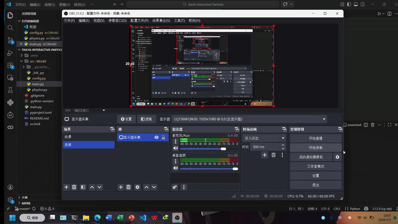

# Interactive Particle Swarm (Taichi-based)

这是一个基于 **Taichi (太极)** 物理引擎开发的交互式粒子仿真项目。通过 GPU 并行计算，实现了数千个粒子实时追踪鼠标光标的动态效果。

---

## 🎥 运行效果



---

## ✨ 项目亮点

* **实时交互**：粒子具有“吸引力”逻辑，会根据鼠标光标的位置实时改变运动轨迹。
* **高性能计算**：利用 Taichi 的 `@ti.kernel` 将计算负载部署在 GPU 上，即使粒子数量巨大也能保持高帧率。
* **现代工具链**：使用 `uv` 进行依赖管理，确保环境的一致性和快速配置。

---

## 🛠️ 快速开始

### 1. 克隆仓库
```bash
git clone https://github.com/codeGease-1/Taichi-Interactive-Particles
cd Taichi-Interactive-Particles
```

### 2. 安装依赖并运行

如果你安装了 [uv](https://github.com/astral-sh/uv)，直接运行以下命令即可（它会自动处理环境与依赖）：

```bash
# uv 会自动创建虚拟环境并安装 Taichi
uv run python src/Work0/main.py
```

---

## 🧪 技术实现简述

本项目核心逻辑位于 `src/Work0/` 目录下，主要涉及以下物理仿真步骤：

### 1. 引力场计算
在每一帧循环中，系统会实时获取当前鼠标在窗口中的空间坐标 $\mathbf{P}_{mouse}$，作为粒子群的动态吸引中心。

### 2. 速度更新
对于每一个粒子 $i$，系统根据其当前位置 $\mathbf{P}_i$ 计算指向鼠标的加速度向量 $\vec{a}$：

$$\vec{a} = k \cdot (\mathbf{P}_{mouse} - \mathbf{P}_i)$$

> **参数说明**：$k$ 为吸引力强度系数，用于控制粒子向目标聚集的响应速度。

### 3. 状态迭代
采用 **Euler 积分 (Euler Integration)** 算法更新粒子的运动状态，通过微小的步长 $\Delta t$ 确保运动轨迹的连续性与平滑度：

* **更新速度**：
    $v_{t+1} = v_t + \vec{a} \cdot \Delta t$
  
* **更新位置**：
    $$\mathbf{P}_{t+1} = \mathbf{P}_t + \mathbf{v}_{t+1} \cdot \Delta t$$

